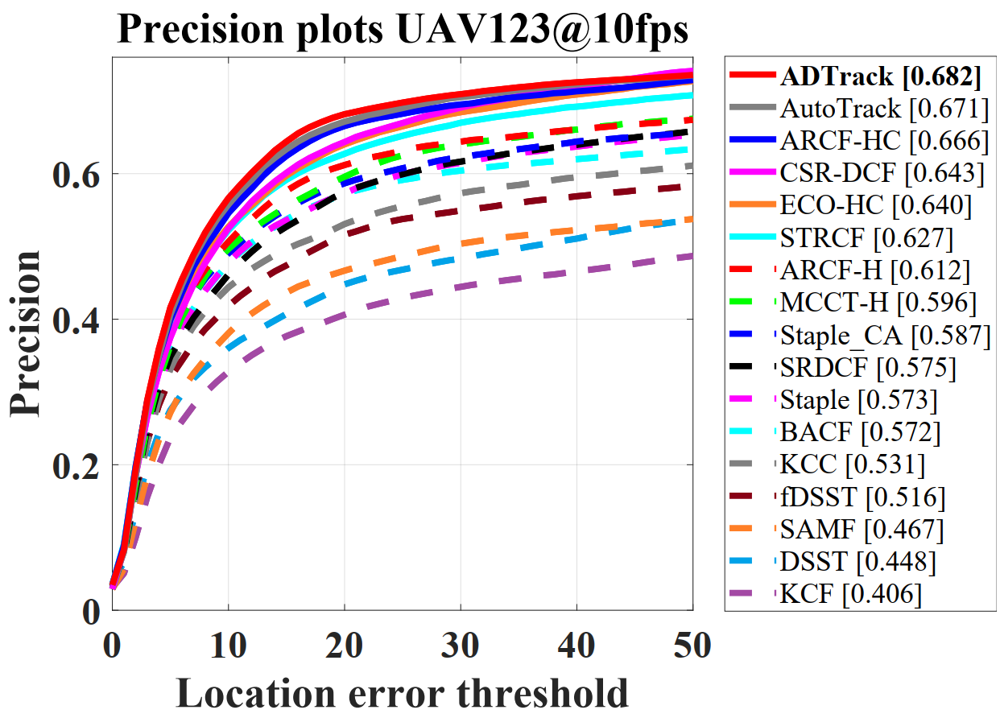
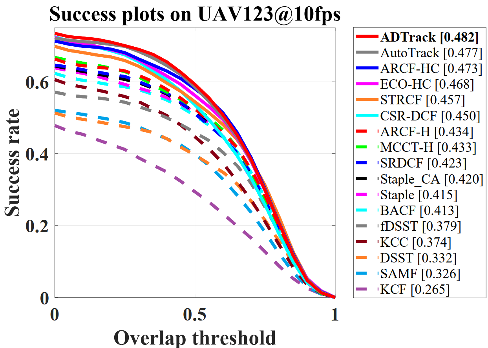
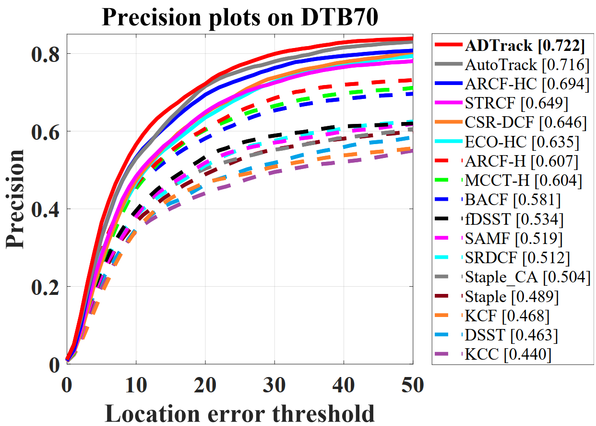
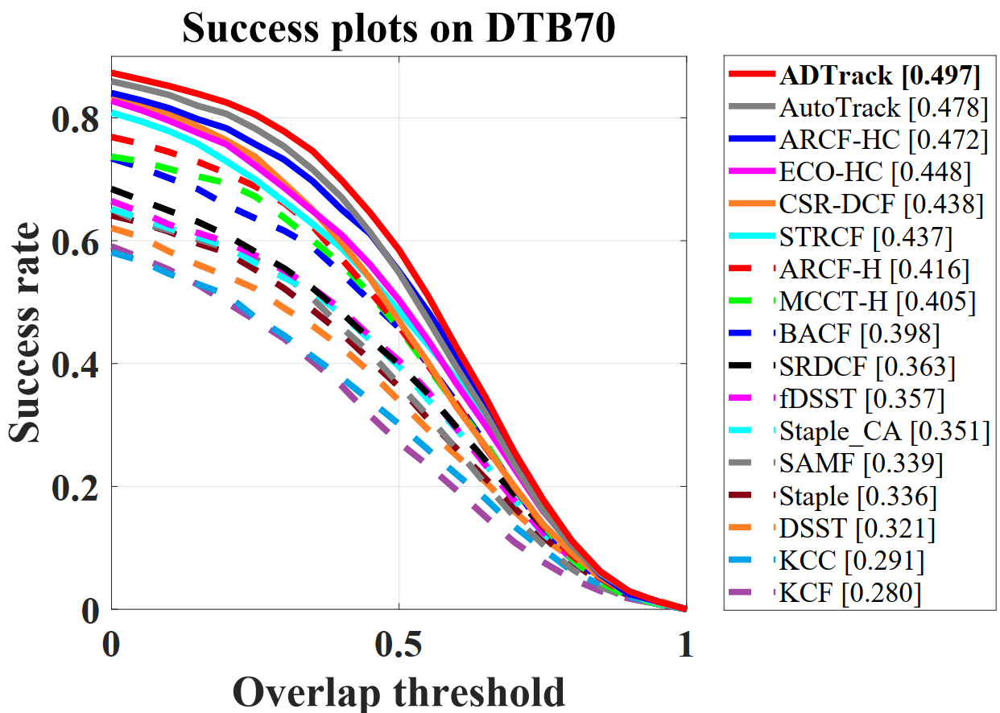
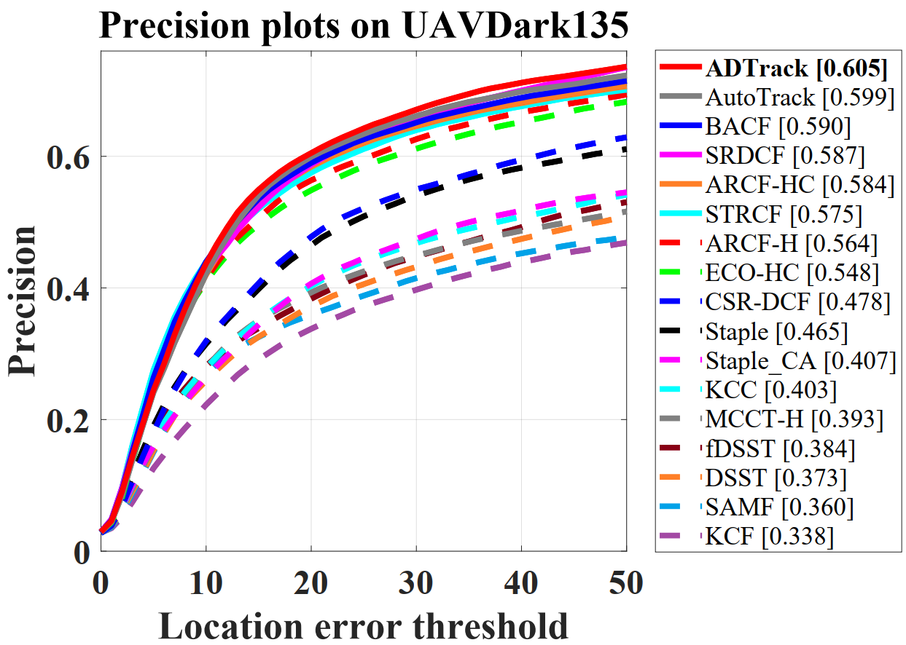
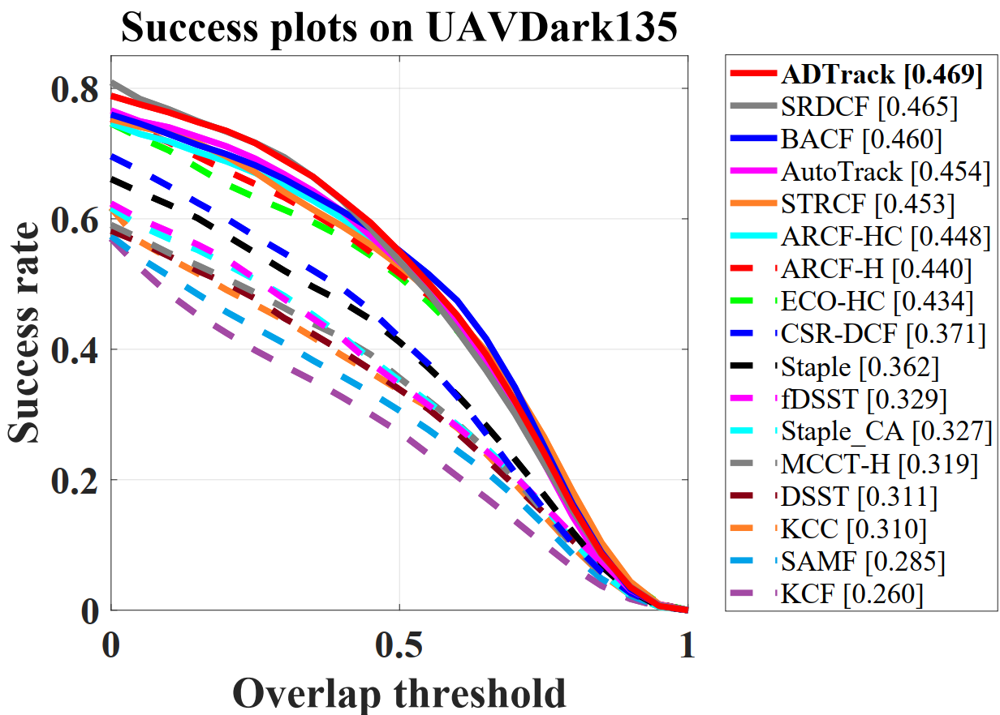

# All-Day Object Tracking for Unmanned Aerial Vehicle 
Matlab implementation of our Real-time illuminative adaptive Anti-Dark tracker (ADTrack).

***journal*** version of _ADTrack: Target-Aware Dual Filter Learning for Real-Time Anti-Dark UAV Tracking, ICRA_

# Abstract

Unmanned aerial vehicle (UAV) has facilitated a wide range of real-world applications and has attracted extensive research in the mobile computing field. Specially, developing real-time robust visual onboard trackers for all-day aerial maneuver can remarkably broaden the scope of intelligent deployment of UAV. However, prior tracking methods have merely focused on robust tracking in the well-illuminated scenes, while ignoring trackers' capabilities to be deployed in the dark. In darkness, the conditions can be more complex and harsh, easily posing inferior robust tracking or even tracking failure. To this end, this work proposes a novel discriminative correlation filter-based tracker with illumination adaptive and anti-dark capability, namely ADTrack. ADTrack firstly exploits image illuminance information to enable adaptability of the model to the given light condition. Then, by virtue of an efficient and effective image enhancer, ADTrack carries out image pretreatment, where a target-aware mask is generated. Benefiting from the mask, ADTrack aims to solve a dual regression problem where dual filters, _i.e._, the context filter and target-focused filter, are online trained with mutual constraint. As a result, ADTrack is able to maintain continuously favorable performance in all-day conditions. Besides, this work also constructs a UAV nighttime tracking benchmark UAVDark135, comprising of more than 125k manually annotated frames. Exhaustive experiments are extended on authoritative daytime benchmarks, \textit{i.e.}, UAV123@10fps, DTB70, and the newly built dark benchmark UAVDark135. Our results have validated the superiority of ADTrack in all-day conditions compared with other arts. Meanwhile, onboard tests have demonstrated that ADTrack realizes a real-time speed of over 30 frames/s on the typical aerial mobile platform, consisting of a single CPU, remarkably ensuring real-world UAV object tracking in all-day scenes.

# Citation
If you uses our tracker, dataset, or relevant data, please cite our paper as:
> @Inproceedings{Li2021ICRA,
>
> title={{ADTrack: Target-Aware Dual Filter Learning for Real-Time Anti-Dark UAV Tracking}}, 
>
> author={B. {Li} and C. {Fu} and F. {Ding} and J. {Ye} and F. {Lin}},
>
> booktitle={Proceedings of the IEEE International Conference on Robotics and Automation (ICRA)},
>
> year={2021},
>
> pages={1-8},
> }

> @ARTICLE{Li_2022_TMC,
> 
> title={{All-Day Object Tracking for Unmanned Aerial Vehicle}}, 
>     
> author={Bowen Li and Changhong Fu and Fangqiang Ding and Junjie Ye and Fuling Lin},
>       
> journal={IEEE Transactions on Mobile Computing}, 
>       
> year={2022},
> 
> pages={1-14},
> }

# Contact

Bowen Li

Email: 1854152@tongji.edu.cn

Changhong Fu

Email: [changhong.fu@tongji.edu.cn](mailto:changhong.fu@tongji.edu.cn)

# Demonstration running instructions

This code is compatible with UAV123@10fps, DTB70 and UAVDark135 benchmark. Therefore, if you want to run it in benchmark, just put ADTrack_v2 folder in trackers, and config sequences and trackers according to instructions from aforementioned benchmarks. 

# Results on UAV datasets

### UAV123@10fps

### DTB70

### UAVDark135

# Benchmark UAVDark135

**UAVDaark135** is a newly constructed **UAV dark tracking** benchmark, containing totally 135 sequences. It covers a large variety of scenes, including street, crossing, T-junction, lakeside, highway, ocean, *etc*.

Here exhibits some representative scenes from UAVDark135:

The benchmark is available at:

https://pan.baidu.com/s/1JcV_wTUSt9F8iBXiLCZQdQ 
extraction code：axci 

# Acknowledgements

We thank the contribution of  H. K. Galoogahi, Ning Wang and Martin Danelljan for their previous work BACF,  MCCT-H and DSST.  The feature extraction modules and some of the parameter are borrowed from the MCCT tracker (https://github.com/594422814/MCCT). The scale estimation method is borrowed from the DSST tracker (http://www.cvl.isy.liu.se/en/research/objrec/visualtracking/scalvistrack/index.html).

