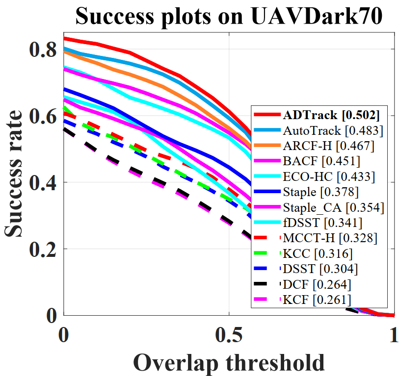
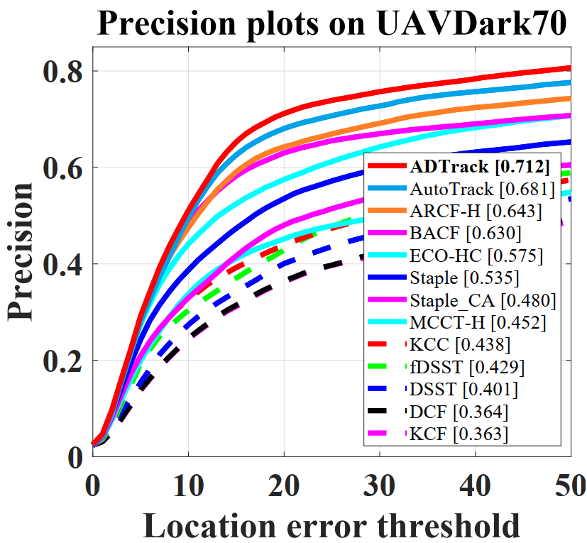
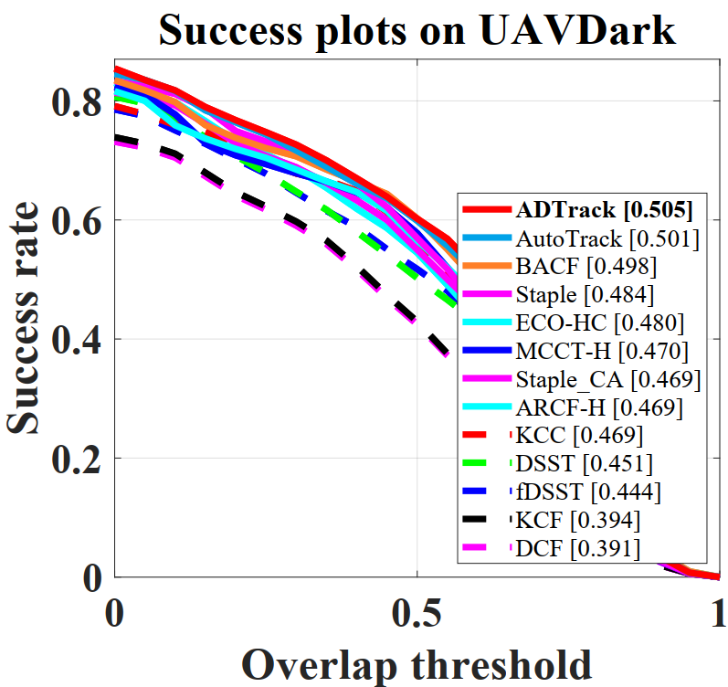
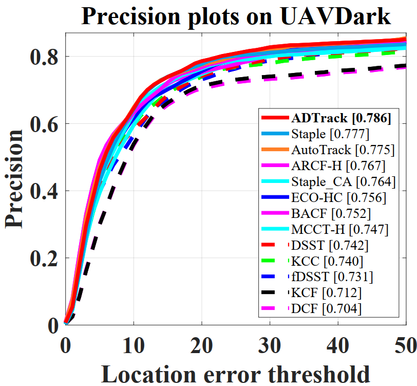
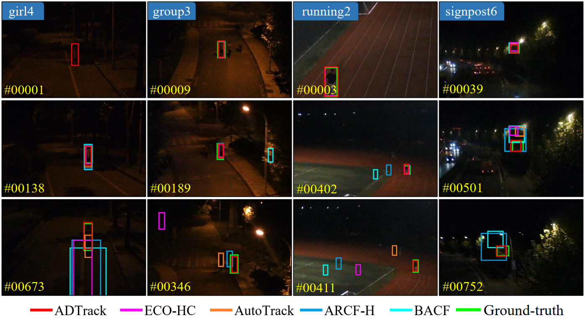

# ADTrack: Target-Aware Dual Filter Learning for Real-Time Anti-Dark UAV Tracking

For journal version of ADTrack, please refer to branch _**journal**_.

# Abstract

Prior correlation filter (CF)-based tracking methods for unmanned aerial vehicles (UAVs) have virtually focused
on tracking in the daytime. However, when the night falls, the trackers will encounter more harsh scenes, which can easily lead to tracking failure. In this regard, this work proposes a novel tracker with anti-dark function (ADTrack). The proposed method integrates an efficient and effective low-light image enhancer into a CF-based tracker. Besides, a target-aware mask is simultaneously generated by virtue of image illumination variation. The target-aware mask can be applied to jointly train a target-focused filter that assists the context filter for robust tracking. Specifically, ADTrack adopts dual regression, where the context filter and the target-focused filter restrict each other for dual filter learning. Exhaustive experiments are conducted on typical dark sceneries benchmark, consisting of 37 typical night sequences from authoritative benchmarks, i.e., UAVDark, and our newly constructed benchmark UAVDark70. The results have shown that ADTrack favorably outperforms other state-of-the-art trackers and achieves a real-time speed of 34 frames/s on a single CPU, thus greatly extending robust UAV tracking to night scenes.

# Citation
If you uses our tracker, dataset, or relevant data, please cite our paper as:
> @Inproceedings{Li2021ICRA,
>
> title={{ADTrack: Target-Aware Dual Filter Learning for Real-Time Anti-Dark UAV Tracking}}, 
>
> author={B. {Li} and C. {Fu} and F. {Ding} and J. {Ye} and F. {Lin}},
>
> booktitle={Proceedings of the IEEE International Conference on Robotics and Automation (ICRA)},
>
> year={2021},
>
> pages={1-8},
> }

> @ARTICLE{Li_2022_TMC,
> 
> title={{All-Day Object Tracking for Unmanned Aerial Vehicle}}, 
>     
> author={Bowen Li and Changhong Fu and Fangqiang Ding and Junjie Ye and Fuling Lin},
>       
> journal={IEEE Transactions on Mobile Computing}, 
>       
> year={2022},
> 
> pages={1-14},
> }

# Contact

Bowen Li

Email: [1854152@tongji.edu.cn](mailto:1854152@tongji.edu.cn)

Changhong Fu

Email: [changhong.fu@tongji.edu.cn](mailto:changhong.fu@tongji.edu.cn)

# Demonstration running instructions

This code is compatible with UAVDark and UAVDark70 benchmark. Therefore, if you want to run it in benchmark, just put ADTrack folder in trackers, and config sequences and trackers according to instructions from aforementioned benchmarks. 

# Results on UAV datasets

### UAVDark70

### UAVDark

## Benchmark UAVDark70

### Visualization of some typical sequences and performance of SOTA trackers

Full benchmark UAVDark70 is available at：https://pan.baidu.com/s/1PTFwNoSxwZBmUSzDD3ti2A 

Extracting code：1234 

# Acknowledgements

We thank the contribution of  H. K. Galoogahi, Ning Wang and Martin Danelljan for their previous work BACF,  MCCT-H and DSST.  The feature extraction modules and some of the parameter are borrowed from the MCCT tracker (https://github.com/594422814/MCCT). The scale estimation method is borrowed from the DSST tracker (http://www.cvl.isy.liu.se/en/research/objrec/visualtracking/scalvistrack/index.html).

